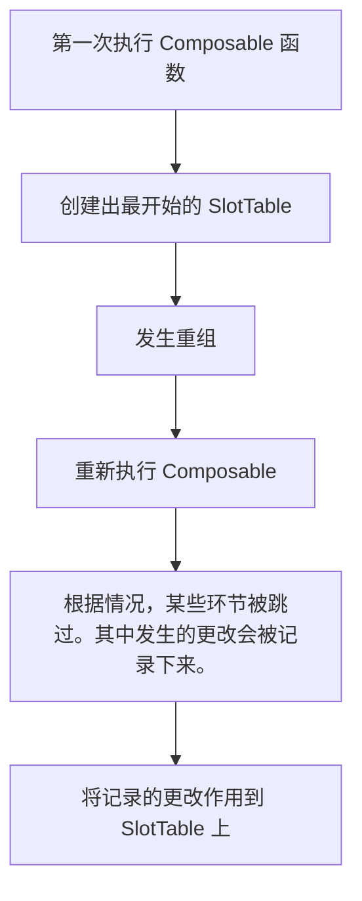
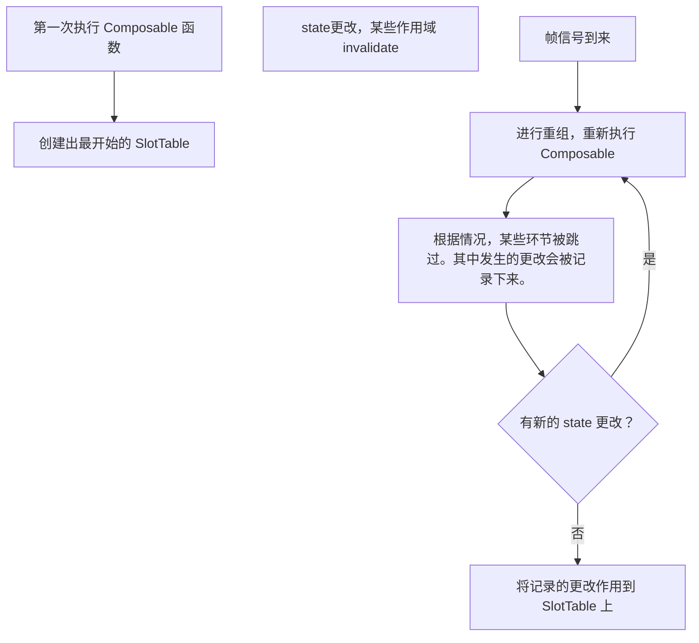
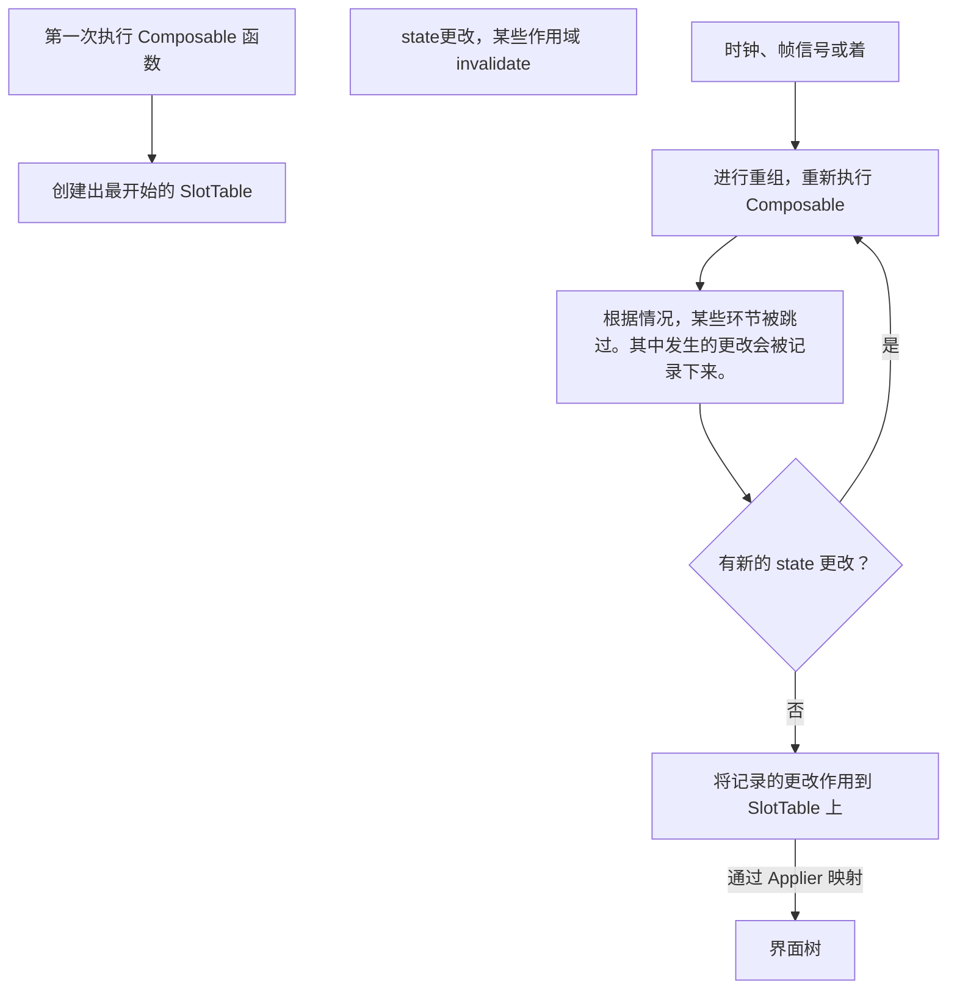

# 浅析 Compose 绘制原理

## 界面树

通常情况下，我们的 UI 以树型数据结构来表示，比如 dom 树，View 树。Compose 也是采用树来表示 UI 结构。既然也是树，那么对于 Compose 的原理我们可以带着这样一些问题去探索：

- Compose 的树有几棵(比如 flutter 的三棵树)，每棵树的作用是什么？
- Compose 的树是如何存储的？
- Compose 的树是如何被构建出来和被修改的？

## 了解 SlotTable

再实际上，Compose 有两棵树，其中较为重要的是 `SlotTable` 类所代表的树，树中的每个结点都是一个 `Group`。`SlotTable` 用一个 `Int` 数组存储了整个树，每个 `Group` 结点的信息由 5 个整型表示。而具体的数据则是存储在 `slots` 中。

在存储上，`SlotTable` 采用了 `GapBuffer` 结构来存储 `groups` 和 `slots`。`GapBuffer` 是一种最开始用于文本编辑的数据结构。它的核心思想是“插入和删除操作通常是扎堆出现在同一个地方”。

例如我们在编辑器中输入“Hello”，之后在“H”之后有输入了“你好”。如果采用传统数组方式的操作是这样的：首先会分配一定大小的数组，然后由于键盘输入的字符是一个一个来的，所以“Hello”这几个字符会一个一个放入数组。之后再插入“你好”，同样由于字符是一个个来的，所以我们先将“ello”都往后移动一格，然后放入“你”，然后再将“ello”均向后移动一格，然后放入“好”。就像下面的图这样。这时我们就会发现一点，传统数组方式会极其频繁地进行元素移动操作，造成性能损失。反过来，删除操作也是类似。



这种情况就是 `GapBuffer` 所要解决的。如果采用这种方式来存储，操作将会像下面这样。在创建数组的时候，我们用一个起始偏移和长度来表示 `Gap`，当然也可以用其它方式。然后插入的时候，我们修改偏移和长度来修改 `Gap`。`GapBuffer` 通过将`Gap` 移动到修改位置来解决问题。因此，再插入“你好”之前，我们将`Gap`的修改偏移来将 `Gap`移动到插入位置，然后将原有的元素“ello”通过复制的方式移动到 `Gap` 之后的区域。这时就有很大一片的`Gap`用来供我们插入。删除也是类似的情况，将 `Gap` 移动到删除位置，然后增加 `Gap` 大小和修改偏移。这样就解决了“插入和删除操作通常是扎堆出现在同一个地方”情况下的性能损耗问题。同时因为 `Gap` 只有一个且位置已知，`GapBuffer` 仍然支持高效的随机访问。



那么回到 `SlotTable` 中，它正是使用这种方式构造了一个树，例如下面的例子，`Counter` 有许多子结点，依次排在 `Counter` 最顶层的`Group` 之后，那么如果因为某些原因，例如外部 `state` 更改，导致 `Counter` 函数不再执行，这时就需要删除 `Counter`及其子结点，这种插入删除操作会集中在一个地方，符合 `GapBuffer` 的应用场景。

```kotlin
@Composable
fun Counter() {
 var count by remember { mutableStateOf(0) }
 Button(
   text="Count: $count",
   onPress={ count += 1 }
 )
}
```


## 进入 @Composable

接下来我们来考虑一下如何构建 `SlotTable` 树。

我们先探究一下 `Composable` 函数。

 `Composable` 注解的处理是由 Compose 实现的 Kotlin Compiler Plugin (KCP) 执行的。类似于我们之前讲的 Java APT，Java 的注解是在 Java 编译期间由编译器去调用注解处理程序处理的。KCP 是 Kotlin 编译期间由 Kotlin 编译器调用的。正因如此，我们的 Compose 只能用 kotlin 编译器编译，也就只能用 Kotlin 编写了。


那么编译器插件做了什么呢？我们观察下边这样一个函数。其中的 `Node1` 和 `Node2` 函数暂时可以理解为一个 `Text` 或者是一个空的函数，之后我们会解释这个函数的具体实现。

```kotlin
@Composable
fun Content() {
    var state by remember { mutableStateOf(true) }
    val composer = currentComposer
    LaunchedEffect(Unit) {
        while (true) {
            delay(5000)
            composer.printSlotTable()
            state = !state
        }
    }
    if (state) {
        Node1()
    }
    Node2()
}
```

最终编译结果会类似下面这样，首先就是会被添加一些参数。

- $composer: 当前可组合项的上下文，提供了操作 `SlotTable` 以及组合的一些方法。
- $changed: 用来表示状态是否发生了变化。发生了变化可能就需要重新执行

```kotlin
@Composable
fun Content($composer: Composer, $changed: Int) {
  	val $compose2 = $composer.startRestartGroup(554112277) // 开始
  	if ($changed != 0 || !$composer2.getSkipping()) {
      $composer2.startReplaceableGroup(-492369756) // 开始
      var state by remember { mutableStateOf(true) }
      $composer2.endReplaceableGroup() // 结束
      val composer = currentComposer
      LaunchedEffect(Unit) {
          while (true) {
              delay(5000)
              composer.printSlotTable()
              state = !state
          }
      }
      $composer2.startReplaceableGroup(-492369756) // 开始
      if (state) {
          Node1()
      }
      $composer2.endReplaceableGroup()  //结束
      Node2()
    } else {
      $composer2.skipToGroupEnd()
    }
	 	$composer2.endRestartGroup()?.updateScope { nextComposer ->
      Content(nextComposer, ...)
    } // 结束
}
```

然后在代码中有许多 `$composer.startXXXGroup` 调用。如我们之前所说的，`Group` 就是 `SlotTable` 中的树结点。这下我们知道这棵树是如何构建起来了。因为被 `@Composable` 注解的本身就是一个函数，执行顺序也是函数。所以在执行 `$composer.startXXXGroup` 时就会创建一个结点插入树中，之后结合 `endXXXGroup` 就可以确定树结点的层级关系。至于 `Node1` 和 `Node2` 函数也会被执行类似的操作，所以最终也会有对应这两个函数的结点产生。

其中不同 `Group` 有着不同含义下面是几个例子：

- ReplaceableGroup: 通常来说对应 if-else 代码块，这个组只能被插入、移除、替换。
- MovableGroup: 是可以根据 datakey 的值进行移动的数组，例如列表中的项。
- RestartGroup: 可以被重组的组。重组时会根据传入的 `updateScope` 进行重组。它会持有我们常说的重组作用域。

### 更改的实现

编译器插件还会加入其他代码用于在一些情况下进行重组和跳过部分结点的创建。例如上面的代码中的 `endRestartGroup()` 会在组内有对状态的访问时返回非空值，这时我们设置更新的方法，在重组时就会调用。而 Compose 会帮我们进行一些判断，如果传入的参数没有发生变化，则会跳过部分组。旧的参数也会被保存在 `SlotTable` 中。

虽然我们的函数没有参数，但是因为存在对状态的访问，所以编译器加上了 `$changed` 参数。如果状态发生修改了，在调用这个函数的时候 `$changed` 就会取真值。这个真值也会决定我们的函数是否应该被跳过。

重组过程会发生对 `SlotTable`  的修改。例如上面的 `state` 不同决定 `Node1` 的绘制与否。以 `Node1` 从不绘制变为需要绘制的情况举例。我们假设 `Node1` 函数内部有着 `$composer.startRestartGroup(114514)`，也就是说这个组的 id 为 114514。在 `startXXXGroup` 内部会查询当前的树，然后发现没有 id 为 114514 的结点，说明我们这次 start 的组是新添加进来的，所以这是一个插入操作。

类似，如果我们有个列表，现在列表项的顺序发生了改变，由于我们给每个表项都设置了 key 所以在执行 start 的时候，我们会在树中发现这些组已经存在了，但是位置不同，说明这是一个移动操作，不需要插入新结点。

但是这些更改不会立即生效，而是会先被记录下来，在组合完成后再进行。

## 目前的情况

目前我们知道的逻辑大致如下



## 如何触发重组

我们都知道状态更改会触发重组，那么具体是如何触发的呢？


重组的触发是由快照系统来实现的，参考[一文看懂 Jetpack Compose 快照系统 - 掘金 (juejin.cn)](https://juejin.cn/post/7095544677515919367#heading-11)

简单来说流程是这样的。

1. 首先在执行 Composable 代码结点

在我们读取 state 的值时会将当前的重组作用域注册，也就是记录下来。这样我们就可以知道有哪些作用域读取了哪些变量。

在我们执行写入操作时，会通过之前到注册信息，将对应的重组作用域标记为 invalid。

2. 帧信号到达时

下一个帧同步信号到达时，会将所有 invalid 的作用域进行重组，重组的方法也就是我们之前提到的 `updateScope` 方法。

3. 多次重组

在执行重组时，可能又会发生 state 的更改。这些更改又会将一些作用域设置为 invalid，所以可能会有多次重组。

## 目前的情况



## 第二棵树

之前我们一直在讨论 `SlotTable` 树，它存储了非常多的信息。而实际上的界面树只有界面相关信息，这个转化是由 `Applier` 实现的。我们的 `composer` 会持有一个 `applier` 实例，在更改 `SlotTable` 的过程中就会通过 `applier` 将界面的更改作用到界面树上。

我们看一下 `Applier` 接口的定义一些关键属性和方法

```kotlin
interface Applier<N> {
  val current: N
  // 在界面树中向下移动
  fun down(node: N)
  // 在界面树中向上移动
  fun up()
  // 两种插入结点的方式
  fun insertTopDown(index: Int, instance: N)
  fun insertBottomUp(index: Int, instance: N)
  // 删除结点
  fun remove(index: Int, count: Int)
  // 移动结点
  fun move(from: Int, to: Int, count: Int)
}
```

有了这个接口的实例，Compose 就可以通过其调度界面树的修改。

但是我们在这里就会发现一件很有意思的事情，就是这是一个范型接口，它的范型参数也就是结点类是没有任何限制的，我们任意定义一个类都可以作为这个范型参数。这也就是为什么 Compose 可以做到跨平台。Compose 通过 Composable 函数以及其他体系，构造了一棵 `SlotTable` 树，同时实现了状态管理等等各种功能，但是 `SlotTable` 并不是一棵可以被绘制的界面树。最终 `SlotTable` 的修改会通过 `Applier` 映射到我们自己定义的界面树上，在每一帧，我们只需要绘制自己的界面树就可以实现 UI。

### Android 中的第二棵树

上面讲的部分位于 `androidx.compose.runtime` 库中，是完全平台无关的部分。而 Android 端的 UI 代码在 `androix.compose.ui:ui-android` 库中，其中对于结点的实现类是 `LayoutNode`，它有着宽高、子结点、布局方向等等属性。这颗树会遵循我们熟知的 measure -> layout -> draw 的顺序被绘制。

## 总结

Compose 通过 KCP 实现了对我们代码的更改。在执行时，Compose Runtime 管理着一棵 `SlotTable` 树，并通过 `Applier` 将这棵树映射到我们自己定义的界面树中。这样我们就可以通过自己持有的界面树进行任何自己想要的绘制操作了。




## 小Demo：自己定义结点并用 Compose 进行管理

```kotlin
internal object GlobalSnapshotManager {
    private val started = AtomicBoolean(false)

    fun ensureStarted() {
        if (started.compareAndSet(false, true)) {
            val channel = Channel<Unit>(Channel.CONFLATED)
            CoroutineScope(AndroidUiDispatcher.Main).launch {
                channel.consumeEach {
                    Snapshot.sendApplyNotifications() // 发送通知applyChanges
                }
            }
            Snapshot.registerGlobalWriteObserver {
                channel.trySend(Unit) // 监听全局Snapshot写入
            }
        }
    }
}
val rootNode = Node.RootNode()
fun myCompose() {
    val composer = Recomposer(Dispatchers.Main)
    GlobalSnapshotManager.ensureStarted()
    val mainScope = MainScope()
    mainScope.launch(AndroidUiFrameClock(Choreographer.getInstance())) {
        composer.runRecomposeAndApplyChanges()
    }


    Composition(NodeApplier(rootNode), composer).apply {
        setContent {
            Content()
        }
    }
}
@Composable
fun Content() {
    var state by remember { mutableStateOf(true) }
    val composer = currentComposer
    LaunchedEffect(Unit) {
        while (true) {
            delay(10000)
            composer.printSlotTable()
            XLog.d("Content: $rootNode")
            state = !state
            XLog.d("Content: state=$state")
        }
    }
    if (state) {
        XLog.d("Content: show node1")
        Node1()
    }
    Node2()
}


sealed class Node {
    val children = mutableListOf<Node>()

    class RootNode : Node() {
        override fun toString(): String {
            return "RootNode(children=$children)"
        }
    }

    data class Node1(
        var name: String = "",
    ) : Node()

    data class Node2(
        var name: String = "",
    ) : Node()
}

class NodeApplier(node: Node) : AbstractApplier<Node>(node) {
    override fun insertTopDown(index: Int, instance: Node) {
        XLog.d("insertTopDown: index=$index, instance=$instance")
        current.children.add(index, instance) // 插入节点
    }

    override fun insertBottomUp(index: Int, instance: Node) {
        XLog.d("insertBottomUp: index=$index, instance=$instance")
        current.children.add(index, instance) // 插入节点
    }

    override fun move(from: Int, to: Int, count: Int) {
        XLog.d("move: from=$from, to=$to, count=$count")
        current.children.move(from, to, count) // 更新节点
    }

    override fun onClear() {
      
    }

    override fun remove(index: Int, count: Int) {
        current.children.remove(index, count) // 移除节点
    }
}

@Composable
fun Node1(name: String = "Node1") {
    ReusableComposeNode<Node.Node1, NodeApplier>(
        factory = {
            Node.Node1()
        },
        update = {
            set(name) { this.name = name }
        }
    )
}

@Composable
fun Node2(name: String = "node2") {

    ReusableComposeNode<Node.Node2, NodeApplier>(
        factory = {
            Node.Node2()
        },
        update = {
            set(name) { this.name = it }
        }
    )
}
```

