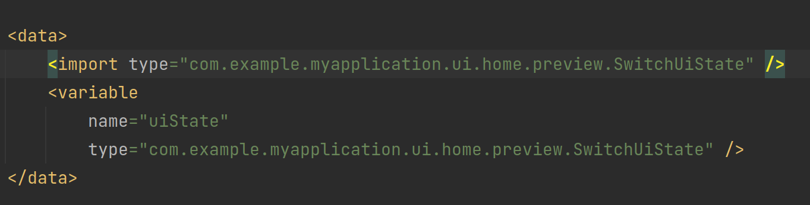

# android view navigation

##### kotlin依赖问题

不同的navigation可能使用的是不同的kotlin依赖。出现过重复添加同一个依赖导致构建错误的情况，建议这种情况下直接导入kotlin。

##### navigate方法的多个重载

```xml
<?xml version="1.0" encoding="utf-8"?>
<navigation xmlns:android="http://schemas.android.com/apk/res/android"
    xmlns:app="http://schemas.android.com/apk/res-auto"
    android:id="@+id/nav_graph"
    app:startDestination="@id/loginFragment">

    <fragment
        android:id="@+id/loginFragment"
        android:name="com.example.myapplication.ui.login.LoginFragment"
        android:label="LoginFragment" >
        <action
            android:id="@+id/action_loginFragment_to_mainFragment"
            app:destination="@id/mainFragment"
            app:popUpTo="@id/loginFragment"
            app:popUpToInclusive="true" />
    </fragment>
    <fragment
        app:route="aaaa"
        android:id="@+id/mainFragment"
        android:name="com.example.myapplication.MainFragment"
        android:label="MainFragment" />
</navigation>
```

对于上面的导航图，要实现从`loginFragment`跳转到`mainFragment`的功能，不同重载功能不同

- `navigate(R.id.mainFragment)`这种方法相当于创建了一个action并导航过去，其他选项可以通过增加参数来添加。
- `navigate(R.id.action_loginFragment_to_mainFragment)`与上一个不同，这个方法是通过现有的action进行跳转，此时`popUpTo`等属性会生效。
- `navigate("aaaa")`根据导航图中定义的`app:route`进行导航。

# android databinding



在databinding layout中使用自定义类型时需要先导入。不导入不影响运行但会飘红。


# android tablayout 点击效果

```xml
app:tabRippleColor="@null"
app:tabBackground="@null"
```

添加上边这两句去除点击效果


# android fragment

在xml中绑定视图后会自动创建一个fragment，此时不需要在用代码添加，否则会同时存在2个fragment


# SeekBar DataBinding

将`SeekBar`的属性用`DataBinding`绑定后，`OnSeekBarChangeListener`会由`DataBinding`自动实现的`SeekBarBindingAdapter`接管，我们自己添加的监听会不起作用。解决方案如下

1. 在ViewModel或者任何合适的地方定义一个函数

```java
public void processRateResult(SeekBar seekBar) {
	Log.d(TAG, "processRateResult: ");
}
```

2. 在xml中通过对象绑定到这个函数

```xml
<variable
            name="fragment"
            type="com.example.myapplication.ui.room.controller.LightFragment" />
...

android:onStopTrackingTouch="@{fragment.processRateResult}"
```

# 动态权限申请

有些权限不允许直接弹窗申请，例如`ACCESS_BACKGROUND_LOCATION`，当申请的权限列表中含有任何一个这种权限时，不会有弹窗出现，同时权限申请自动被拒绝。

# 源文件路径问题(e.g. *.so file)

见[Configure build variants  | Android Studio  | Android Developers](https://developer.android.com/build/build-variants#sourcesets)中`sourceSets`部分。最终的应用源文件路径似乎在`main`中。对于自定义源文件路径，可以用下边的方法

```groovy
android {
    sourceSets {
        main {
            jniLibs.srcDirs = ['src/main/cpp/lib']
        }
    }
}
```

