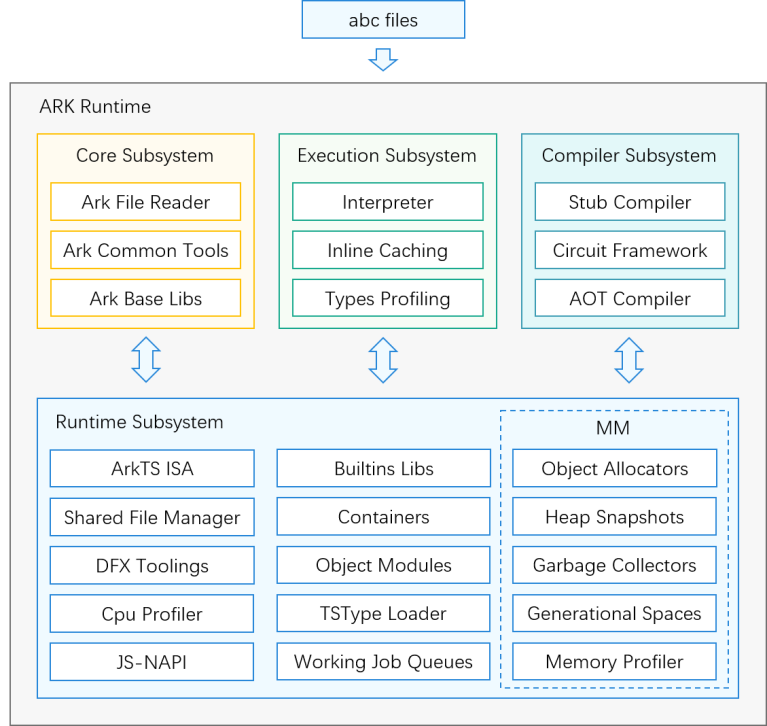
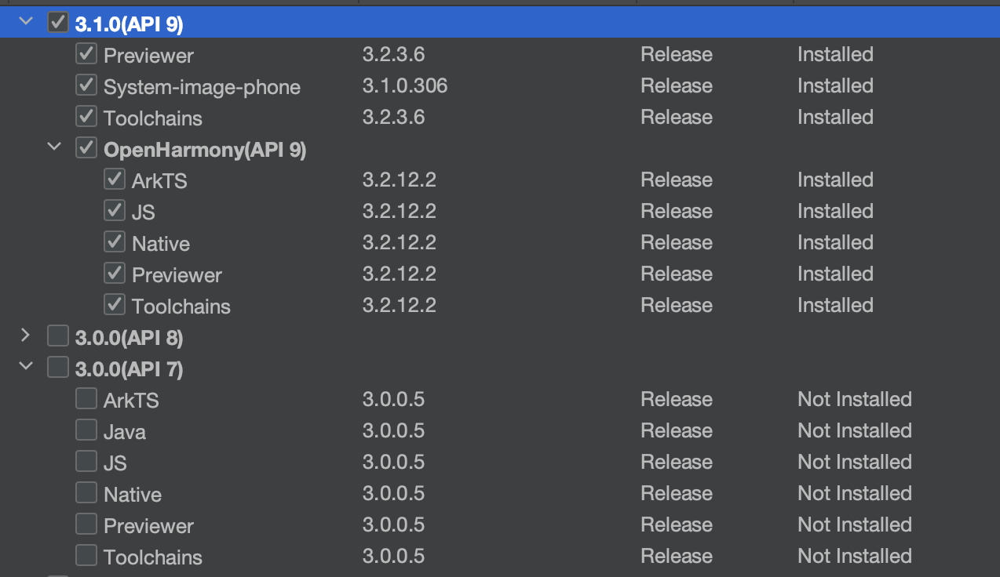
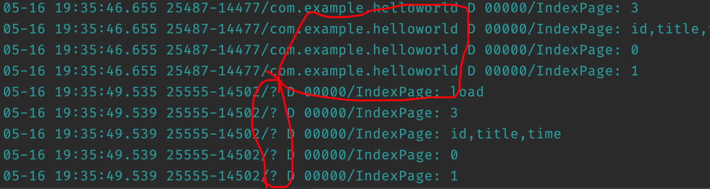
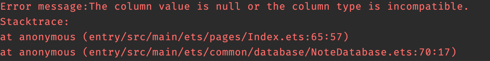

# 鸿蒙简介

## 打开鸿蒙😤(OpenHarmony)

OpenHarmony是由开放原子开源基金会（OpenAtom Foundation）孵化及运营的开源项目，目标是面向全场景、全连接、全智能时代，基于开源的方式，搭建一个**智能终端设备**操作系统的框架和平台，促进**万物互联产业**的繁荣发展。

OpenHarmony支持如下几种系统类型：

- 轻量系统（mini system）

  面向MCU类处理器例如Arm Cortex-M、RISC-V 32位的设备，硬件资源极其有限，支持的设备最小内存为128KiB，可以提供多种轻量级网络协议，轻量级的图形框架，以及丰富的IOT总线读写部件等。可支撑的产品如智能家居领域的连接类模组、传感器设备、穿戴类设备等。

- 小型系统（small system）

  面向应用处理器例如Arm Cortex-A的设备，支持的设备最小内存为1MiB，可以提供更高的安全能力、标准的图形框架、视频编解码的多媒体能力。可支撑的产品如智能家居领域的IP Camera、电子猫眼、路由器以及智慧出行域的行车记录仪等。

- 标准系统（standard system）

  面向应用处理器例如Arm Cortex-A的设备，支持的设备最小内存为128MiB，可以提供增强的交互能力、3D GPU以及硬件合成能力、更多控件以及动效更丰富的图形能力、完整的应用框架。可支撑的产品如高端的冰箱显示屏。


### 版本介绍

#### v2.0

基本上是一个正式的系统。

- 增加了标准系统版本(standard system)。
- 提供系统三大应用：桌面、设置和SystemUI。
- 提供了又好又坏的的OpenHarmony应用框架和Ability框架。
- 提供了JS应用开发能力，JS的编译、执行环境，一些基础库和API接口。
- 提供了键值对存储数据的方式，存在本地文件中，可加载到内存。

#### v3.0

实现了的基础功能。

- 支持方舟JS编译工具链和运行时(ArkCompiler Runtime Subsystem)，支持OpenHarmmony JS UI框架应用开发和运行，推出了ArkUI框架
- 用户程序框架支持服务能力(ServiceAbility，DataAbility)和线程模型。
- 支持文件安全访问，即文件转成URI和解析URI打开文件的能力。

- 相机应用支持预览、拍照和录像基础能力。
- 支持输入法框架及支持输入基础英文字母、符号和数字。
- 关系型数据库和分布式数据管理

#### v3.1

- 增加了ArkUI子系统，提供了使用ArkTS语言的应用开发能力
- 本地音视频播放能力，相机预览、拍摄能力
- 鼠标键盘等设备支持、常见传感器支持
- 提供了联系人、短信、通话、相机、图库等系统应用以及卡片功能

## 方舟编译器(ArkCompiler)

ArkCompiler是华为自研的统一编程平台，包含编译器、工具链、运行时等关键部件，支持高级语言在多种芯片平台的编译与运行。

ArkTS/TS/JS源码 -> 二进制方舟字节码文件(.abc) -> AOT和PGO工具将部分字节码编译为机器码 -> 方舟运行时的`ark_js_vm`执行程序



## 鸿蒙系统

HarmonyOS=AOSP+OpenHarmony+Others

API7是最后一个支持JAVA开发的API版本



# 鸿蒙开发

## Java开发

安卓套壳

## Stage模型

使用ArkTs语言和ArkUI框架

## FA模型

ArkTs/JS/TS


# 开发障碍

## 获取上下文context

为了在`@Component`中获取context进行一些操作，需要调用`getContext()`函数，然而这是一个全局函数，你可以在任意不合理的地方调用这个函数。例如随意写一个全局函数或是一个全局变量:

```typescript
// Test.ets
let x = getContext(this)
function foo() {
  getContext(this)
}
```

`getContext` 函数仅在 `.ets` 文件中可以使用。

## 应用识别问题



hilog输出日常无法识别应用包名，导致无法根据应用筛选日志

## 报错无法阅读

一个只有44行的文件报错在65行。事实上，这个问题在于我没有调用`resultSet.goToFirstRow()`



