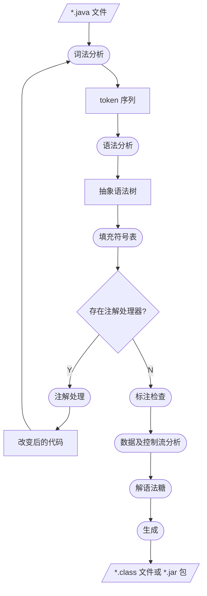

# 入门注解与元编程

**元编程**是一种编程技巧，一部分程序可以将其他程序视作它们的数据。这意味着一个程序可以被用作读取、生成、分析或者改造其他程序，甚至是更改它自己。（[Metaprogramming - Wikipedia](https://en.wikipedia.org/wiki/Metaprogramming#:~:text=Metaprogramming is a programming technique,even modify itself while running.)）

## 目标

```java
package com.example.people;
import com.pjb.HelloAnn;
@HelloAnn("Hello World! I'm Person class.")
public class Person {
}
```

给一个类加上注解，最终需要生成下面的代码。

```java
package com.example.people;
/**
 * A comment from options
 * @author peijunbo
 * Generated by HelloProcessor, do not edit this file!
 */
public class HelloPerson {
    public static void hello() {
        System.out.println("Hello, world! I'm Person class.");
    }
}
```

## Step 1 定义注解

Java 注解是一种代表元数据的标签，可以提供额外信息给编译器和 JVM。一定程度上可以将注解理解为注释，一个给人看，一个给程序看。因此，**注解只起标注作用，不负责实现任何逻辑**。

Java 提供了一些**元注解**，元注解是专门用于修饰注解的注解。

1. `@Retention` - 标注这个注解保留至什么时间段，编译期、class 文件、运行时。
2. `@Documented` - 标记这些注解是否包含在用户文档中。
3. `@Target` - 标记这个注解应该修饰哪种 Java 符号。
4. `@Inherited` - 标记这个注解是否自动被继承。
5. `@Repeatable` - 标识某注解可以在同一个声明上使用多次。

如下定义一个注解：

```java
@Target(ElementType.TYPE)
@Retention(RetentionPolicy.SOURCE)
public @interface HelloAnn {
    String value() default "Hello World!";
}
```

如下使用注解：

```java
@HelloAnn("Hello, world! I'm Person class.")
public class Person {
}
```

## Step 2 定义注解处理器

在这一步，我们需要定义出注解处理器，在处理器中实现需要的操作。

在 Java 中，注解处理器应该继承 `javax.annotation.processing.AbstractProcessor` 类。我们需要提供支持的注解类型、jdk版本等信息。可以通过添加注解，或是重写 `AbstractProcessor` 类的对应方法来提供这些信息。

通过 `roundEnv` 参数获取使用了指定注解的元素。

通过 `processingEnv` 成员变量获取各种工具、命令行参数、源文件生成器等。

```java
@SupportedSourceVersion(SourceVersion.RELEASE_17)
@SupportedAnnotationTypes("com.pjb.HelloAnn")
@SupportedOptions({"comment", "author"})
public class HelloProcessor extends AbstractProcessor {
    @Override
    public boolean process(Set<? extends TypeElement> annotations, RoundEnvironment roundEnv) {
	      if (annotations.isEmpty()) {
            System.out.println("No annotations");
            return false;
        }
				// 处理逻辑
        Map<String, String> options = processingEnv.getOptions();
        Set<? extends Element> elements = roundEnv.getElementsAnnotatedWith(HelloAnn.class);
        // generate Hello***.class for each annotated class
        for (Element element : elements) {
            // 获取类名、包名等信息
            String className = element.getSimpleName().toString();
            PackageElement packageElement = processingEnv.getElementUtils().getPackageOf(element);
            String packageName = packageElement.getQualifiedName().toString();
            String fullClassName = packageName.isEmpty() ? "Hello" + className : packageName + ".Hello" + className;
            String newClassName = "Hello" + className;
            // 拼接新文件内容
            StringBuilder classStringBuilder = new StringBuilder();
            if (!packageName.isEmpty()) {
                classStringBuilder.append("package ").append(packageName).append(";\n");
            }
            classStringBuilder.append("/**\n");

            if (options.get("comment") != null) {
                classStringBuilder.append(" * ").append(options.get("comment")).append("\n");
            }

            if (options.get("author") != null) {
                classStringBuilder.append(" * @author ").append(options.get("author")).append("\n");
            }
            classStringBuilder.append(" * Generated by HelloProcessor, do not edit this file!\n");
            classStringBuilder.append(" */\n");

            String newClass =
                    "public class " + newClassName + " {\n" +
                    "    public static void hello() {\n" +
                    "        System.out.println(\"" + element.getAnnotation(HelloAnn.class).value() + "\");\n" +
                    "    }\n" +
                    "}\n";
            classStringBuilder.append(newClass);

            // 生成新文件
            try {
                System.out.println("Generating " + fullClassName + "...");
                Writer writer = processingEnv.getFiler().createSourceFile(fullClassName).openWriter();
                writer.append(classStringBuilder.toString());
                writer.close();
            } catch (Exception e) {
                e.printStackTrace();
            }
        }
        return true;
    }

}

```


## Java 编译流程

从编译流程中我们可以知道注解是如何从一个标记变为代码的。



## Step 3 指定注解处理器

通过编译流程我们知道了注解处理器会被编译器调用，因此我们需要通过一些方法让编译器或者构建工具知道哪里有注解处理器以及使用哪个注解处理器

### Javac

javac 是 Java 的编译指令，命令有下面几个与注解相关的参数：

- `-Akey[=value]`                传递给注释处理程序的选项
- `-proc:{none,only}`            控制是否执行注释处理和/或编译。
- `-processor <class1>[,<class2>,<class3>...]`        要运行的注释处理程序的名称
- `--processor-module-path <path>`        指定查找注释处理程序的模块路径
- `--processor-path <path>, -processorpath <path>`        指定查找注释处理程序的位置

###### 例子

编译前的项目结构

```
.
├── annotation
│   ├── HelloAnn.java // 注解
│   └── HelloProcessor.java // 注解处理器
├── build.sh
└── src
    └── main
        └── Java
            └── com
                └── example
                    └── Person.java // 添加了注解的类
```

编译脚本

```sh
# compile annotation and annotation processor
Javac -d ann annotation/HelloAnn.Java annotation/HelloProcessor.Java
# compile source code
Javac -d out -processor com.annotation.processor.HelloProcessor src/main/Java/com/example/Person.Java -cp ann -Aauthor=peijunbo -Acomment="A comment from options"
```

编译后的项目结构

```
.
├── ann
│   └── com
│       └── annotation
│           ├── HelloAnn.class
│           └── processor
│               └── HelloProcessor.class
├── annotation
│   ├── HelloAnn.java
│   └── HelloProcessor.java
├── build.sh
├── out
│   └── com
│       └── example
│           ├── HelloPerson.class
│           ├── HelloPerson.java
│           └── Person.class
└── src
    └── main
        └── java
            └── com
                └── example
                    └── Person.java
```

### gradle

#### 构建注解处理器模块

一般 gradle module 最终会打包出一个 jar 包。为了让 gradle 知道 jar 包中哪些类可以被当作注解处理器使用，我们需要添加一些配置文件。

jar 格式规范中有一个可选的 `META-INF` 目录（[META-INF 目录说明]([JAR File Specification (oracle.com)](https://docs.oracle.com/en/java/javase/21/docs/specs/jar/jar.html#the-meta-inf-directory))），该目录用于存放一些关于 jar 包的配置信息。gradle 默认会将 `src/main/resources/META-INF`目录打包至最终的 jar 中。

首先在 `META-INF/services/` 目录下创建文件名为 `Javax.annotation.processing.Processor` 的文本文件，在文件内写下自定义注解处理器的全类名。例如 `com.pjb.processor.HelloProcessor`。多个处理器间通过换行分隔。

最后构建这个模块。


#### 使用注解处理器

在 gradle 脚本中添加注解依赖和注解处理器即可。

```kotlin
dependencies {
		...
    annotationProcessor(project(":ann-java"))
    implementation(project(":ann-java"))
//    implementation(project(":ann-kotlin"))
//    ksp(project(":ann-kotlin"))
}
```

## Kotlin

在 Kotlin 中定义注解与 Java 类似，有基本的元注解可以使用。参考[[Annotations | Kotlin Documentation (kotlinlang.org)](https://kotlinlang.org/docs/annotations.html)]。

Kotlin 处理注解主要有两种方式 [KSP](https://kotlinlang.org/docs/ksp-overview.html) 和 [kapt](https://kotlinlang.org/docs/kapt.html)。

kapt 通过将 Kotlin 代码首先转为 Java 代码的方式来支持 Java 的注解处理器。

KSP 则直接对 Kotlin 代码进行分析，只能用于 Kotlin 注解但速度更快。


